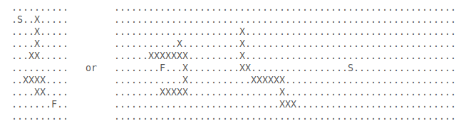

## Preamble

Hi ambitious coder, welcome to my very first public github project. Okay, back
to the point. Have you ever wonder how to make program that is able to find
shortest distance between 2 points in the grid ? If Yes, welcome. You are on
the right track. At first, I should highlight, that I don't know (at this point)
any kinds of algorithms that are able to do that, but I will encourage myself
to come to the results. I think, I have quite a good logical thinking that would
help me a lot to solve this kind of problem. I will study on my own. I wanna show
here progress, how my code will behave. I hope so, we will reach the target. If you
will have any kinds of questions or improvements about my code, you can contact me
by sending me an email.

## Path Finder Problem

Let's imagine that you have some kind of grid. It can by square or rectangle of 
different sizes. Your aim is to find shortest path between two points
(Start represented as 'S' and Finish represented as 'F') and don't forget
to avoid obstacles represented by sign 'X' and blank spaces will be represented by '.'.

## Examples of grids

